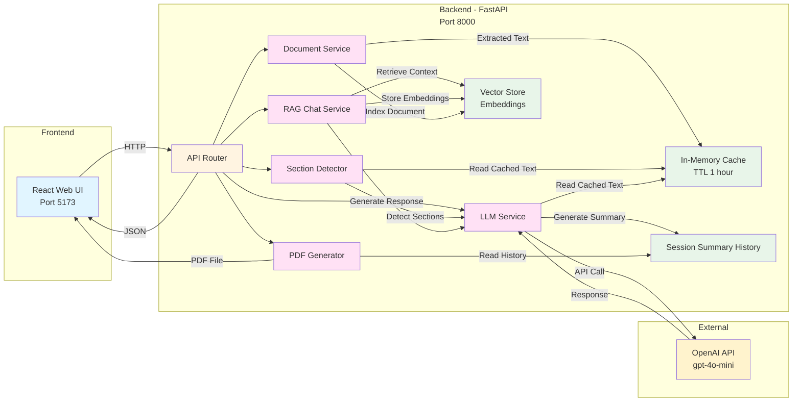

<p align="center">
  
</p>

# 📊 FinSights - Financial Document Summarization AI Blueprint

AI-powered financial document analysis with intelligent section-based summarization using OpenAI's GPT models.

---

## 📋 Table of Contents

- [Project Overview](#project-overview)
- [Architecture](#architecture)
- [Get Started](#get-started)
  - [Prerequisites](#prerequisites)
  - [Quick Start](#quick-start)
- [Project Structure](#project-structure)
- [Usage Guide](#usage-guide)
- [Environment Variables](#environment-variables)
- [Technology Stack](#technology-stack)
- [Troubleshooting](#troubleshooting)
- [License](#license)

---

## Project Overview

**FinSights** is an intelligent financial document analysis platform that processes financial documents (PDF, DOCX) to generate comprehensive summaries with dynamically generated, document-driven sections and an interactive chat interface for context-aware analysis.

### How It Works

1. **Document Upload & Processing**: Users upload or paste financial documents. The system extracts and caches the raw text.
2. **Dynamic Section Generation**: Based on the document content, the system intelligently generates relevant financial analysis sections tailored to the specific document.
3. **Section-wise Summarization**: Users can then generate summaries for each dynamically detected section, allowing them to explore different aspects of the financial document at their own pace.
4. **Chat with RAG**: Users can interact with an intelligent chat interface that uses Retrieval Augmented Generation (RAG) to answer questions about the uploaded document, providing context-aware responses based on the actual document content.

The platform leverages OpenAI's GPT-4o-mini model for intelligent content analysis and summarization. The backend caches extracted documents, allowing users to explore different sections without re-uploading the same document. The RAG-powered chat system enables conversational analysis of financial documents with high accuracy.

---

## Architecture

The application follows a modular microservices architecture with specialized components for document processing, dynamic section detection, AI-powered summarization, and RAG-based chat:



### Architecture Components

**Frontend (React)**
- User-friendly interface for document upload and section exploration
- Real-time display of dynamically detected sections
- Summary viewing and export functionality
- Interactive chat interface for RAG-based document queries

**Backend Services**
- **Document Service**: Extracts text from PDF/DOCX files with validation
- **Section Detector**: Analyzes document content and identifies relevant financial sections
- **LLM Service**: Generates section-specific summaries using OpenAI API
- **PDF Generator**: Creates formatted PDF exports of summaries
- **RAG Chat Service**: Implements Retrieval Augmented Generation (RAG) for context-aware question answering about uploaded documents
- **Vector Store**: Manages document embeddings for efficient semantic search in RAG operations
- **Cache System**: In-memory caching of extracted documents (1-hour TTL)
- **History System**: Maintains session summary records

**External Integration**
- **OpenAI API**: GPT-4o-mini model for intelligent content analysis, summarization, and RAG-based chat responses

---

## Get Started

### Prerequisites

Before you begin, ensure you have the following installed and configured:

- **Docker and Docker Compose** (v20.10+)
  - [Install Docker](https://docs.docker.com/get-docker/)
  - [Install Docker Compose](https://docs.docker.com/compose/install/)
- **OpenAI API Key** (for GPT-4o-mini access)
  - [Create OpenAI Account](https://platform.openai.com/account/api-keys)
  - [API Key Management](https://platform.openai.com/account/billing/overview)

#### Verify Installation

```bash
# Check Docker
docker --version
docker compose version

# Verify Docker is running
docker ps
```

### Quick Start

#### 1. Clone or Navigate to Repository

```bash
# If cloning:
git clone git@github.com:cld2labs/FinSights.git
cd FinSights
```

#### 2. Configure Environment Variables

Create `backend/.env` with your OpenAI credentials:

```bash
cat > backend/.env << EOF
# OpenAI Configuration (REQUIRED)
OPENAI_API_KEY=your_openai_api_key_here
OPENAI_MODEL=gpt-4o-mini

# LLM Configuration
LLM_TEMPERATURE=0.2
LLM_MAX_TOKENS=900

# Caching Configuration
CACHE_MAX_DOCS=25
CACHE_TTL_SECONDS=3600

# Service Configuration
SERVICE_PORT=8000
LOG_LEVEL=INFO

# CORS Settings
CORS_ORIGINS=*
EOF
```

**Replace** `your_openai_api_key_here` with your actual OpenAI API key.

#### 3. Launch the Application

**Option A: Standard Deployment**

```bash
# Build and start all services
docker compose up --build

# Or run in detached mode (background)
docker compose up -d --build
```

**Option B: View Logs While Running**

```bash
# All services
docker compose up --build

# In another terminal, view specific logs
docker compose logs -f backend
docker compose logs -f frontend
```

#### 4. Access the Application

Once containers are running, access:

- **Frontend UI**: http://localhost:5173
- **Backend API**: http://localhost:8000
- **API Documentation**: http://localhost:8000/docs
- **API Redoc**: http://localhost:8000/redoc

#### 5. Verify Services

```bash
# Check health status
curl http://localhost:8000/health

# View running containers
docker compose ps
```

#### 6. Stop the Application

```bash
docker compose down
```

---


## Project Structure

```
FinSights/
├── backend/
│ ├── api/
│ │ └── routes.py        # API endpoints (document upload, summaries, sections)
│ ├── services/
│ │ ├── llm_service.py   # OpenAI LLM integration and section summarization
│ │ ├── pdf_service.py    # PDF/DOCX extraction and OCR handling
│ │ ├── rag_service.py    # Document-aware RAG logic (doc_id based)
│ │ └── vector_store.py    # In-memory ephemeral vector store
│ ├── server.py            # FastAPI application entry point
│ ├── config.py             # Environment and app configuration
│ ├── requirements.txt      # Python dependencies
│ └── Dockerfile           # Backend container
├── frontend/
│ ├── src/
│ │ ├── pages/
│ │ │ └── Generate.jsx     # Main document upload and section analysis page
│ │ ├── components/        # Reusable UI components
│ │ ├── services/           # API client utilities
│ │ └── App.jsx            # Application root
│ ├── package.json         # npm dependencies
│ └── Dockerfile          # Frontend container
├── docker-compose.yml    # Service orchestration
└── README.md             # Project documentation
```

---


## Usage Guide

### Using FinSights

1. **Open the Application**
   - Navigate to `http://localhost:5173`

2. **Choose Input Method**
   - **Paste Text Tab**: Copy/paste financial document text directly
   - **Upload File Tab**: Upload PDF or DOCX files (max 50MB)

3. **Generate Summary**
   - Click "Summarize" button
   - Wait for AI processing
   - View comprehensive financial summary

4. **Explore Financial Sections**
- Click any dynamically generated section chip to view detailed analysis.
- Sections are created automatically based on the document content and are not predefined.
- For example: Financial Performance, Key Metrics, Risks, Opportunities, Outlook / Guidance, and Other Important Highlights.
- Switching sections is instant (cached document).

5. **Chat with Your Document (RAG)**
   - Use the chat interface to ask questions about the document
   - System retrieves relevant sections and provides context-aware answers
   - Ask follow-up questions for deeper insights
   - Examples:
     - "What are the main revenue streams?"
     - "What risks are mentioned in this document?"
     - "What is the projected growth rate?"

6. **Export Results**
   - Click "Export as PDF" button
   - Save formatted summary to your computer

7. **View History**
   - All previous summaries in chat-like history
   - Scroll through past analyses
   - Re-explore or export any summary

### Performance Tips

- **Large PDFs**: For PDFs > 100 pages, only first 100 pages are processed
- **Best Results**: Clearly formatted financial documents with structured text
- **Caching**: First analysis processes document, subsequent sections are instant
- **Temperature Setting**: Default 0.2 ensures consistent, focused summaries

---

## Environment Variables

Configure the application behavior using environment variables in `backend/.env`:

| Variable | Description | Default | Type |
|----------|-------------|---------|------|
| `OPENAI_API_KEY` | OpenAI API key for LLM access (REQUIRED) | - | string |
| `OPENAI_MODEL` | LLM model used for summarization and analysis | `gpt-4o-mini` | string |
| `LLM_TEMPERATURE` | Model creativity level (0.0–2.0, lower = deterministic) | `0.2` | float |
| `LLM_MAX_TOKENS` | Maximum tokens per response | `900` | integer |
| `RAG_ENABLED` | Enable document-aware RAG flow | `true` | boolean |
| `RAG_MODE` | RAG strategy used (`doc_id` = cached full-document context) | `doc_id` | string |
| `RAG_TOP_K` | Number of top relevant context segments used internally | `5` | integer |
| `EMBEDDING_MODEL` | Embedding model for internal relevance scoring (if applicable) | `text-embedding-3-small` | string |
| `VECTOR_RESET_ON_UPLOAD` | Clear vector dataset when a new document is uploaded | `true` | boolean |
| `VECTOR_RESET_ON_REFRESH` | Clear vector dataset when the client refreshes the site | `true` | boolean |
| `CACHE_MAX_DOCS` | Maximum documents stored in memory cache | `25` | integer |
| `CACHE_TTL_SECONDS` | Cache time-to-live in seconds | `3600` | integer |
| `SERVICE_PORT` | Backend API port | `8000` | integer |
| `LOG_LEVEL` | Logging level (DEBUG, INFO, WARNING, ERROR) | `INFO` | string |
| `CORS_ORIGINS` | Allowed CORS origins (comma-separated or `*`) | `*` | string |
| `MAX_PDF_PAGES` | Maximum PDF pages to process | `100` | integer |
| `MAX_PDF_SIZE` | Maximum PDF file size in bytes | `52428800` | integer |

**Note:**  
This blueprint uses a **document-cached RAG approach without static chunking**.  
- The full extracted document is cached by `doc_id` for fast section switching.  
- When a new document is uploaded or the client is refreshed, the in-memory vector dataset is automatically cleared to prevent context leakage across documents.


---

## Technology Stack

### Backend
- **Framework**: FastAPI (Python web framework)
- **AI / LLM**: OpenAI GPT-4o-mini (document-aware analysis)
- **RAG Architecture**: In-memory, document-cached RAG using `doc_id` (no static chunking)
- **Embeddings**: OpenAI embeddings (used internally for relevance scoring when required)
- **Document Processing**:
  - pypdf (PDF text extraction)
  - python-docx (DOCX processing)
  - pdf2image + pytesseract (OCR for image-based PDFs)
- **State Management**:
  - In-memory document cache
  - Ephemeral vector dataset (cleared on new upload or client refresh)
- **Async Server**: Uvicorn (ASGI)
- **Config Management**: python-dotenv for environment variables

### Frontend
- **Framework**: React 18 with React Router
- **Build Tool**: Vite (fast bundler)
- **Styling**: Tailwind CSS + PostCSS
- **UI Components**: Lucide React icons
- **RAG UX**:
  - Dynamic, document-driven section chips
  - Instant section switching using cached context
- **Export**: jsPDF for PDF generation
- **Notifications**: react-hot-toast

---


## Troubleshooting

Encountering issues? Check the following:

### Common Issues

**Issue**: API not responding
```bash
# Check service health
curl http://localhost:8000/health

# View backend logs
docker compose logs backend
```

**Issue**: OpenAI API errors
- Verify `OPENAI_API_KEY` is correct and has credits
- Check API key permissions in OpenAI dashboard
- Ensure model `gpt-4o-mini` is available in your account

**Issue**: PDF upload fails
- Max file size: 50MB
- Max pages: 100 pages
- Supported formats: PDF, DOCX
- Ensure file is not corrupted

**Issue**: Frontend can't connect to API
- Verify backend is running: `docker compose ps`
- Check CORS settings in `.env`
- Ensure both services are on same network

### Debug Mode

Enable debug logging:

```bash
# Update .env
LOG_LEVEL=DEBUG

# Restart services
docker compose restart backend
docker compose logs -f backend
```


---


## License

This project is licensed under our [LICENSE](./LICENSE.md) file for details.


---

## Disclaimer

**FinSights** is provided as-is for analysis and informational purposes. While we strive for accuracy:

- Always verify AI-generated summaries against original documents
- Do not rely solely on AI summaries for investment decisions
- Consult financial advisors for investment guidance
- Test thoroughly before using in production environments

For full disclaimer details, see [DISCLAIMER.md](./DISCLAIMER.md)

---


[Back to Top](#-finsights---financial-document-summarization-ai-blueprint)
