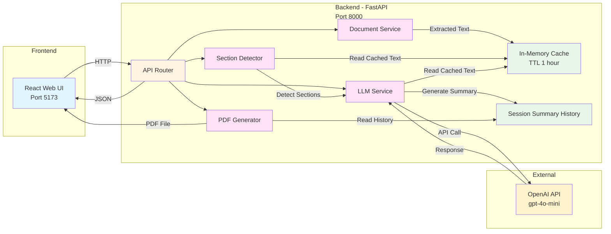

# 📊 FinSights - Financial Document Summarization AI Blueprint

AI-powered financial document analysis with intelligent section-based summarization using OpenAI's GPT models.

---

## 📋 Table of Contents

- [Project Overview](#project-overview)
- [Architecture](#architecture)
- [Get Started](#get-started)
  - [Prerequisites](#prerequisites)
  - [Quick Start](#quick-start)
- [Features](#features)
- [Project Structure](#project-structure)
- [Usage Guide](#usage-guide)
- [Environment Variables](#environment-variables)
- [Technology Stack](#technology-stack)
- [Troubleshooting](#troubleshooting)
- [License](#license)

---

## Project Overview

**FinSights** is an intelligent financial document analysis platform that processes text and financial documents (PDF, DOCX) to generate comprehensive summaries with dynamically generated sections.

### How It Works

1. **Document Upload & Processing**: Users upload or paste financial documents. The system extracts and caches the raw text.
2. **Dynamic Section Generation**: Based on the document content, the system intelligently generates relevant financial analysis sections tailored to the specific document.
3. **Section-wise Summarization**: Users can then generate summaries for each dynamically detected section, allowing them to explore different aspects of the financial document at their own pace.

The platform leverages OpenAI's GPT-4o-mini model for intelligent content analysis and summarization. The backend caches extracted documents, allowing users to explore different sections without re-uploading the same document.

---

## Architecture

The application follows a modular microservices architecture with specialized components for document processing, dynamic section detection, and AI-powered summarization:



### Architecture Components

**Frontend (React)**
- User-friendly interface for document upload and section exploration
- Real-time display of dynamically detected sections
- Summary viewing and export functionality

**Backend Services**
- **Document Service**: Extracts text from PDF/DOCX files with validation
- **Section Detector**: Analyzes document content and identifies relevant financial sections
- **LLM Service**: Generates section-specific summaries using OpenAI API
- **PDF Generator**: Creates formatted PDF exports of summaries
- **Cache System**: In-memory caching of extracted documents (1-hour TTL)
- **History System**: Maintains session summary records

**External Integration**
- **OpenAI API**: GPT-4o-mini model for intelligent content analysis and summarization

---

## Get Started

### Prerequisites

Before you begin, ensure you have the following installed and configured:

- **Docker and Docker Compose** (v20.10+)
  - [Install Docker](https://docs.docker.com/get-docker/)
  - [Install Docker Compose](https://docs.docker.com/compose/install/)
- **OpenAI API Key** (for GPT-4o-mini access)
  - [Create OpenAI Account](https://platform.openai.com/account/api-keys)
  - [API Key Management](https://platform.openai.com/account/billing/overview)

#### Verify Installation

```bash
# Check Docker
docker --version
docker compose version

# Verify Docker is running
docker ps
```

### Quick Start

#### 1. Clone or Navigate to Repository

```bash
# If cloning:
git clone <your-repo-url>
cd FinSights
```

#### 2. Configure Environment Variables

Create `backend/.env` with your OpenAI credentials:

```bash
cat > backend/.env << EOF
# OpenAI Configuration (REQUIRED)
OPENAI_API_KEY=your_openai_api_key_here
OPENAI_MODEL=gpt-4o-mini

# LLM Configuration
LLM_TEMPERATURE=0.2
LLM_MAX_TOKENS=900

# Caching Configuration
CACHE_MAX_DOCS=25
CACHE_TTL_SECONDS=3600

# Service Configuration
SERVICE_PORT=8000
LOG_LEVEL=INFO

# CORS Settings
CORS_ORIGINS=*
EOF
```

**Replace** `your_openai_api_key_here` with your actual OpenAI API key.

#### 3. Launch the Application

**Option A: Standard Deployment**

```bash
# Build and start all services
docker compose up --build

# Or run in detached mode (background)
docker compose up -d --build
```

**Option B: View Logs While Running**

```bash
# All services
docker compose up --build

# In another terminal, view specific logs
docker compose logs -f backend
docker compose logs -f frontend
```

#### 4. Access the Application

Once containers are running, access:

- **Frontend UI**: http://localhost:5173
- **Backend API**: http://localhost:8000
- **API Documentation**: http://localhost:8000/docs
- **API Redoc**: http://localhost:8000/redoc

#### 5. Verify Services

```bash
# Check health status
curl http://localhost:8000/health

# View running containers
docker compose ps
```

#### 6. Stop the Application

```bash
docker compose down
```

---

### Architecture Components

**Frontend (React)**
- User-friendly interface for document upload and section exploration
- Real-time display of dynamically detected sections
- Summary viewing and export functionality

**Backend Services**
- **Document Service**: Extracts text from PDF/DOCX files with validation
- **Section Detector**: Analyzes document content and identifies relevant financial sections
- **LLM Service**: Generates section-specific summaries using OpenAI API
- **PDF Generator**: Creates formatted PDF exports of summaries
- **Cache System**: In-memory caching of extracted documents (1-hour TTL)
- **History System**: Maintains session summary records

**External Integration**
- **OpenAI API**: GPT-4o-mini model for intelligent content analysis and summarization

---

## Features (Advanced)

**Backend**

- Multiple input format support (text, PDF, DOCX)
- PDF text extraction with OCR support for image-based PDFs using pytesseract
- DOCX document processing with python-docx
- Dynamic section detection based on document content analysis
- Section-wise AI-powered summarization using OpenAI's GPT-4o-mini model
- Intelligent context-aware analysis for each generated section
- Smart document caching system (1-hour TTL, up to 25 documents) to avoid reprocessing
- File validation and size limits (PDF/DOCX: 50 MB)
- Page limit protection (max 100 pages per PDF) to prevent timeouts
- Streaming response support for optimal performance
- CORS enabled for web integration
- Comprehensive error handling and logging
- Health check endpoints
- Modular architecture (routes + services + LLM service + document service + section detector)

**Frontend**

- Clean, intuitive interface with tab-based input selection (Text / File)
- Drag-and-drop file upload capability
- Dynamic section detection display showing available financial sections
- Real-time summary generation with clickable financial section chips
- Section-wise summary exploration without re-uploading
- Chat-like history view of all summaries
- PDF export functionality for generated summaries
- Mobile-responsive design with Tailwind CSS
- Built with Vite for fast development and hot module replacement

---

## Project Structure

```
FinSights/
├── backend/
│   ├── api/
│   │   └── routes.py          # API endpoints
│   ├── services/
│   │   ├── llm_service.py     # OpenAI integration
│   │   └── pdf_service.py     # Document processing
│   ├── server.py              # FastAPI app
│   ├── config.py              # Configuration
│   ├── requirements.txt        # Python dependencies
│   └── Dockerfile             # Backend container
├── frontend/
│   ├── src/
│   │   ├── pages/             # React pages
│   │   ├── components/        # React components
│   │   ├── services/          # API client
│   │   └── App.jsx            # Main app
│   ├── package.json           # npm dependencies
│   └── Dockerfile             # Frontend container
├── docker-compose.yml         # Service orchestration
└── README.md                  # This file
```

---

## Get Started

### Prerequisites

Before you begin, ensure you have the following installed and configured:

- **Docker and Docker Compose** (v20.10+)
  - [Install Docker](https://docs.docker.com/get-docker/)
  - [Install Docker Compose](https://docs.docker.com/compose/install/)
- **OpenAI API Key** (for GPT-4o-mini access)
  - [Create OpenAI Account](https://platform.openai.com/account/api-keys)
  - [API Key Management](https://platform.openai.com/account/billing/overview)

#### Verify Installation

```bash
# Check Docker
docker --version
docker compose version

# Verify Docker is running
docker ps
```

### Quick Start

#### 1. Clone or Navigate to Repository

```bash
# If cloning:
git clone <your-repo-url>
cd FinSights
```

#### 2. Configure Environment Variables

Create `backend/.env` with your OpenAI credentials:

```bash
cat > backend/.env << EOF
# OpenAI Configuration (REQUIRED)
OPENAI_API_KEY=your_openai_api_key_here
OPENAI_MODEL=gpt-4o-mini

# LLM Configuration
LLM_TEMPERATURE=0.2
LLM_MAX_TOKENS=900

# Caching Configuration
CACHE_MAX_DOCS=25
CACHE_TTL_SECONDS=3600

# Service Configuration
SERVICE_PORT=8000
LOG_LEVEL=INFO

# CORS Settings
CORS_ORIGINS=*
EOF
```

**Replace** `your_openai_api_key_here` with your actual OpenAI API key.

#### 3. Launch the Application

**Option A: Standard Deployment**

```bash
# Build and start all services
docker compose up --build

# Or run in detached mode (background)
docker compose up -d --build
```

**Option B: View Logs While Running**

```bash
# All services
docker compose up --build

# In another terminal, view specific logs
docker compose logs -f backend
docker compose logs -f frontend
```

#### 4. Access the Application

Once containers are running, access:

- **Frontend UI**: http://localhost:5173
- **Backend API**: http://localhost:8000
- **API Documentation**: http://localhost:8000/docs
- **API Redoc**: http://localhost:8000/redoc

#### 5. Verify Services

```bash
# Check health status
curl http://localhost:8000/health

# View running containers
docker compose ps
```

#### 6. Stop the Application

```bash
docker compose down
```

---

## Usage Guide

### Using FinSights

1. **Open the Application**
   - Navigate to `http://localhost:5173`

2. **Choose Input Method**
   - **Paste Text Tab**: Copy/paste financial document text directly
   - **Upload File Tab**: Upload PDF or DOCX files (max 50MB)

3. **Generate Summary**
   - Click "Summarize" button
   - Wait for AI processing
   - View comprehensive financial summary

4. **Explore Financial Sections**
   - Click any section chip to view detailed analysis:
     - Financial Performance
     - Key Metrics
     - Risks
     - Opportunities
     - Outlook / Guidance
     - Other Important Highlights
   - Switching sections is instant (cached document)

5. **Export Results**
   - Click "Export as PDF" button
   - Save formatted summary to your computer

6. **View History**
   - All previous summaries in chat-like history
   - Scroll through past analyses
   - Re-explore or export any summary

### Performance Tips

- **Large PDFs**: For PDFs > 100 pages, only first 100 pages are processed
- **Best Results**: Clearly formatted financial documents with structured text
- **Caching**: First analysis processes document, subsequent sections are instant
- **Temperature Setting**: Default 0.2 ensures consistent, focused summaries

---

## Environment Variables

Configure the application behavior using environment variables in `backend/.env`:

| Variable | Description | Default | Type |
|----------|-------------|---------|------|
| `OPENAI_API_KEY` | OpenAI API key for GPT access (REQUIRED) | - | string |
| `OPENAI_MODEL` | GPT model version to use | `gpt-4o-mini` | string |
| `LLM_TEMPERATURE` | Model creativity level (0.0-2.0, lower = deterministic) | `0.2` | float |
| `LLM_MAX_TOKENS` | Maximum tokens per summary response | `900` | integer |
| `CACHE_MAX_DOCS` | Maximum documents in memory cache | `25` | integer |
| `CACHE_TTL_SECONDS` | Cache time-to-live in seconds | `3600` | integer |
| `SERVICE_PORT` | Backend API port | `8000` | integer |
| `LOG_LEVEL` | Logging level (DEBUG, INFO, WARNING, ERROR) | `INFO` | string |
| `CORS_ORIGINS` | Allowed CORS origins (comma-separated or `*`) | `*` | string |
| `MAX_PDF_PAGES` | Maximum PDF pages to process | `100` | integer |
| `MAX_PDF_SIZE` | Maximum PDF file size in bytes | `52428800` | integer |

### Configuration Examples

**Production Setup**
```bash
OPENAI_API_KEY=sk-your-production-key
OPENAI_MODEL=gpt-4o-mini
LLM_TEMPERATURE=0.1
LOG_LEVEL=WARNING
CACHE_MAX_DOCS=50
CORS_ORIGINS=https://yourdomain.com,https://app.yourdomain.com
```

**Development Setup**
```bash
OPENAI_API_KEY=sk-your-dev-key
OPENAI_MODEL=gpt-4o-mini
LLM_TEMPERATURE=0.5
LOG_LEVEL=DEBUG
CACHE_MAX_DOCS=10
```

---


---

## Technology Stack

### Backend
- **Framework**: FastAPI (Python web framework)
- **AI/LLM**: OpenAI GPT-4o-mini API
- **Document Processing**: 
  - pypdf (PDF text extraction)
  - python-docx (DOCX processing)
  - pdf2image + pytesseract (OCR for image-based PDFs)
- **Async**: Uvicorn ASGI server
- **Config**: Python-dotenv for environment management

### Frontend
- **Framework**: React 18 with React Router
- **Build Tool**: Vite (fast bundler)
- **Styling**: Tailwind CSS + PostCSS
- **UI Components**: Lucide React icons
- **Export**: jsPDF for PDF generation
- **Notifications**: react-hot-toast

### DevOps
- **Containerization**: Docker + Docker Compose
- **Architecture**: Microservices with isolated containers
- **Networking**: Docker bridge network

---

## Troubleshooting

Encountering issues? Check the following:

### Common Issues

**Issue**: API not responding
```bash
# Check service health
curl http://localhost:8000/health

# View backend logs
docker compose logs backend
```

**Issue**: OpenAI API errors
- Verify `OPENAI_API_KEY` is correct and has credits
- Check API key permissions in OpenAI dashboard
- Ensure model `gpt-4o-mini` is available in your account

**Issue**: PDF upload fails
- Max file size: 50MB
- Max pages: 100 pages
- Supported formats: PDF, DOCX
- Ensure file is not corrupted

**Issue**: Frontend can't connect to API
- Verify backend is running: `docker compose ps`
- Check CORS settings in `.env`
- Ensure both services are on same network

### Debug Mode

Enable debug logging:

```bash
# Update .env
LOG_LEVEL=DEBUG

# Restart services
docker compose restart backend
docker compose logs -f backend
```


---


## License

This project is licensed under our custom license - see [LICENSE](./LICENSE) file for details.


---

## Disclaimer

**FinSights** is provided as-is for analysis and informational purposes. While we strive for accuracy:

- Always verify AI-generated summaries against original documents
- Do not rely solely on AI summaries for investment decisions
- Consult financial advisors for investment guidance
- Test thoroughly before using in production environments

For full disclaimer details, see [DISCLAIMER.md](./DISCLAIMER.md)

---

## Support & Feedback

Have suggestions or encountered an issue?

- 🐛 [Report Bugs](https://github.com/your-org/finsights/issues)
- 💡 [Request Features](https://github.com/your-org/finsights/issues)
- 💬 [Start Discussions](https://github.com/your-org/finsights/discussions)
- 📧 [Contact Us](mailto:support@yourdomain.com)

---


[Back to Top](#-finsights---financial-document-summarization-ai-blueprint)